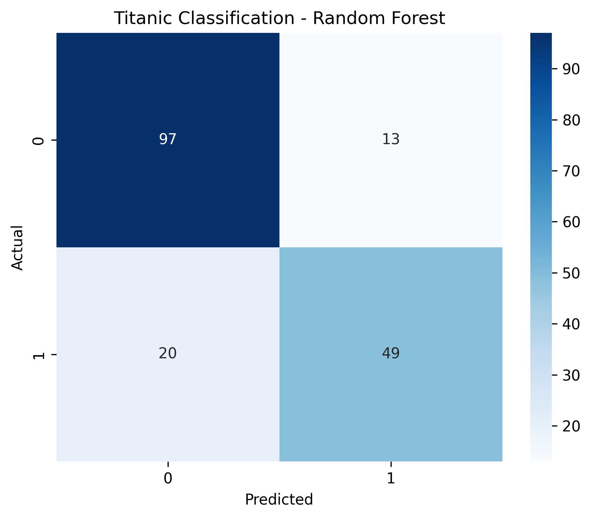
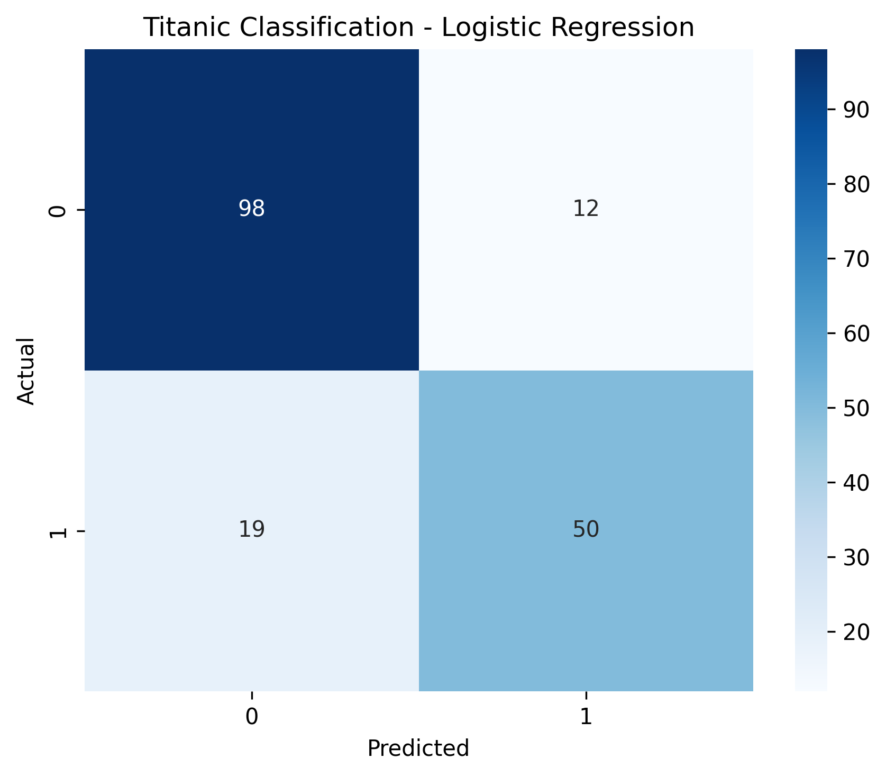
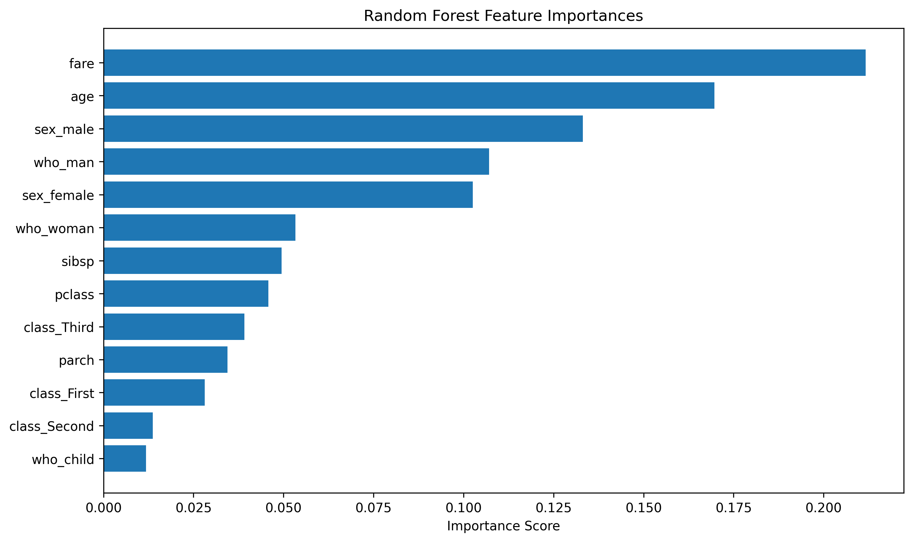
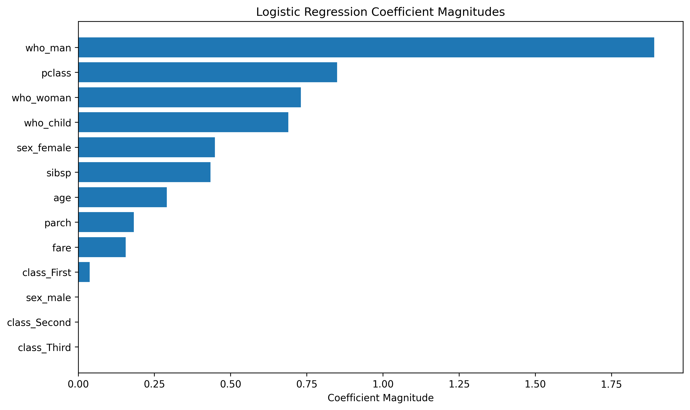

# 🚢 Titanic Survival Prediction

> A complete machine learning classification workflow combining structured preprocessing, `Pipeline`, `ColumnTransformer`, cross-validation, `GridSearchCV`, Random Forest, and Logistic Regression to predict passenger survival.

---

## 📌 Project Overview

This project builds and compares two supervised learning classifiers for **Titanic passenger survival prediction**.

The objective is to demonstrate a clean end-to-end machine learning workflow:

- Handle missing values
- Process numerical and categorical features separately
- Scale numerical features
- One-hot encode categorical features
- Combine preprocessing and modeling with `Pipeline`
- Tune hyperparameters using `GridSearchCV`
- Use stratified cross-validation
- Evaluate models on an untouched test set
- Analyze Random Forest feature importance
- Analyze Logistic Regression coefficient magnitudes
- Compare model performance using classification metrics and confusion matrices

The implementation is organized into reusable Python modules rather than placing the complete workflow in one script.

---

## 🎯 Problem Statement

Given passenger information such as passenger class, sex, age, fare, and family-related attributes, predict whether the passenger survived.

**Target variable:** `survived`

| Value | Meaning |
|------:|---------|
| `0` | Did not survive |
| `1` | Survived |

---

## 📊 Dataset

The project uses the **Titanic dataset provided through Seaborn's dataset loader**.

The dataset is loaded with:

```python
sns.load_dataset("titanic")
```

### Selected Features

```text
pclass
sex
age
sibsp
parch
fare
class
who
adult_male
alone
```

### Target

```text
survived
```

---

## 🧠 Machine Learning Workflow

```text
Titanic Dataset
       │
       ▼
Feature Selection
       │
       ▼
Stratified Train/Test Split
       │
       ├──────────────────────────────┐
       ▼                              ▼
Numerical Features              Categorical Features
       │                              │
       ▼                              ▼
Median Imputation             Most-Frequent Imputation
       │                              │
       ▼                              ▼
StandardScaler                 OneHotEncoder
       │                              │
       └──────────────┬───────────────┘
                      ▼
               ColumnTransformer
                      │
                      ▼
                  Pipeline
                      │
             ┌────────┴────────┐
             ▼                 ▼
      Random Forest     Logistic Regression
             │                 │
             └────────┬────────┘
                      ▼
                GridSearchCV
                      │
                      ▼
             Stratified 5-Fold CV
                      │
                      ▼
               Best Estimator
                      │
                      ▼
              Held-Out Test Set
                      │
             ┌────────┴─────────┐
             ▼                  ▼
      Model Evaluation     Model Analysis
             │                  │
             ▼                  ├── RF Feature Importance
      Accuracy / Report         └── LR Coefficients
      Confusion Matrix
```

---

## ⚙️ Preprocessing

### Numerical Pipeline

```python
Pipeline([
    ("imputer", SimpleImputer(strategy="median")),
    ("scaler", StandardScaler())
])
```

Numerical missing values are replaced using the median, followed by standardization.

### Categorical Pipeline

```python
Pipeline([
    ("imputer", SimpleImputer(strategy="most_frequent")),
    ("onehot", OneHotEncoder(handle_unknown="ignore"))
])
```

Categorical missing values are replaced using the most frequent category, followed by one-hot encoding.

### ColumnTransformer

`ColumnTransformer` applies the appropriate preprocessing workflow to numerical and categorical columns independently.

Because preprocessing is part of the model pipeline, transformations are learned inside each cross-validation training split rather than being fitted on validation data.

---

## 🔍 Hyperparameter Tuning

### Random Forest

```python
{
    "classifier__n_estimators": [50, 100],
    "classifier__max_depth": [None, 10, 20],
    "classifier__min_samples_split": [2, 5],
}
```

This produces:

```text
2 × 3 × 2 = 12 configurations
```

With 5-fold cross-validation:

```text
12 × 5 = 60 fits
```

### Logistic Regression

```python
{
    "classifier__solver": ["liblinear"],
    "classifier__penalty": ["l1", "l2"],
    "classifier__class_weight": [None, "balanced"],
}
```

This produces:

```text
1 × 2 × 2 = 4 configurations
```

With 5-fold cross-validation:

```text
4 × 5 = 20 fits
```

The best configuration from cross-validation is then refitted on the complete training set before final evaluation on the held-out test set.

---

## 📈 Results

### Model Comparison

| Model | Best CV Accuracy | Test Accuracy |
|---|---:|---:|
| Random Forest | **84.69%** | 81.56% |
| Logistic Regression | 81.60% | **82.68%** |

### 🌲 Random Forest

**Best parameters**

```text
max_depth = 10
min_samples_split = 5
n_estimators = 50
```

**Test performance**

```text
Accuracy   : 81.56%
Macro F1   : 80.14%
Weighted F1: 81.36%
```

**Confusion Matrix**

```text
                 Predicted
                 0      1
Actual  0       97     13
        1       20     49
```



### 📐 Logistic Regression

**Best parameters**

```text
class_weight = None
penalty      = l1
solver       = liblinear
```

**Test performance**

```text
Accuracy   : 82.68%
Macro F1   : 81.34%
Weighted F1: 82.49%
```

**Confusion Matrix**

```text
                 Predicted
                 0      1
Actual  0       98     12
        1       19     50
```



### 🏆 Key Result

Random Forest achieved the stronger **cross-validation accuracy**, but Logistic Regression achieved the higher **held-out test accuracy**:

```text
Logistic Regression: 82.68%
Random Forest      : 81.56%
```

The difference is relatively small, indicating similar overall predictive performance on this dataset.

---

## 🔎 Model Interpretation

### Random Forest Feature Importance

The strongest transformed features in the Random Forest include:

- `fare`
- `age`
- `sex_male`
- `who_man`
- `sex_female`
- `who_woman`
- `sibsp`
- `pclass`



### Logistic Regression Coefficient Magnitudes

The largest coefficient magnitudes include:

- `who_man`
- `pclass`
- `who_woman`
- `who_child`
- `sex_female`
- `sibsp`
- `age`



> **Interpretation note:** Titanic variables such as `sex`, `who`, and `class` contain related information. Therefore, individual feature importance or coefficient magnitudes should not be interpreted as completely independent effects.

---

## 🏗️ Project Structure

```text
Titanic-Survival-Prediction/
│
├── main.py
│
├── src/
│   ├── __init__.py
│   ├── config.py
│   ├── data_loader.py
│   ├── preprocessing.py
│   ├── trainer.py
│   ├── evaluator.py
│   └── visualizer.py
│
├── outputs/
│   ├── random_forest_confusion_matrix.png
│   ├── random_forest_feature_importances.png
│   ├── logistic_regression_confusion_matrix.png
│   └── logistic_regression_coefficients.png
│
├── requirements.txt
├── .gitignore
└── README.md
```

### Module Responsibilities

| Module | Responsibility |
|---|---|
| `config.py` | Project paths, feature definitions, CV settings, and hyperparameter grids |
| `data_loader.py` | Load the Titanic dataset |
| `preprocessing.py` | Train/test split and preprocessing pipelines |
| `trainer.py` | Build model pipelines and perform GridSearchCV |
| `evaluator.py` | Generate predictions and evaluation metrics |
| `visualizer.py` | Generate evaluation and model-interpretation plots |
| `main.py` | Orchestrate the complete workflow |

---

## 🚀 Installation & Usage

### 1. Clone the repository

```bash
git clone https://github.com/ayushman652/Titanic-Survival-Prediction.git
cd Titanic-Survival-Prediction
```

### 2. Install dependencies

```bash
pip install -r requirements.txt
```

### 3. Run the project

```bash
python main.py
```

The Titanic dataset is loaded through Seaborn, so no separate dataset file is required in the repository.

Generated visualizations are saved inside:

```text
outputs/
```

---

## 🧪 Reproducibility

The workflow uses fixed random states for the train/test split, cross-validation, and model initialization where applicable.

The train/test split uses stratification to preserve the target-class distribution.

Cross-validation uses:

```text
5 folds
shuffle=True
random_state=42
```

The held-out test set is not used during hyperparameter selection.

---

## 🧩 Why Pipeline + GridSearchCV?

A major focus of the project is combining preprocessing and model training into a single workflow.

Instead of manually performing:

```text
fit scaler
→ transform data
→ fit encoder
→ transform data
→ train model
```

the complete workflow is represented as:

```text
Preprocessing → Classifier
```

`GridSearchCV` can then evaluate the complete pipeline across different hyperparameter configurations.

This makes the workflow reproducible and helps prevent preprocessing leakage during cross-validation.

---

## 💡 Key Takeaways

- Preprocessing and model training can be combined cleanly with `Pipeline`.
- `ColumnTransformer` allows numerical and categorical features to use different preprocessing strategies.
- `GridSearchCV` systematically searches multiple hyperparameter combinations.
- Stratified cross-validation helps preserve class proportions across folds.
- Cross-validation performance and final test performance can rank models differently.
- Random Forest provides feature importance, while Logistic Regression provides coefficient-based interpretation.
- Feature interpretation requires care when multiple variables encode overlapping information.

---

## 🛠️ Tech Stack

**Languages & Libraries**

`Python` · `Pandas` · `NumPy` · `Scikit-learn` · `Matplotlib` · `Seaborn`

**Machine Learning**

`Random Forest` · `Logistic Regression` · `Pipeline` · `ColumnTransformer` · `GridSearchCV` · `StratifiedKFold`

**Preprocessing**

`SimpleImputer` · `StandardScaler` · `OneHotEncoder`

---

## 📄 License

This project is intended for educational and portfolio purposes.
